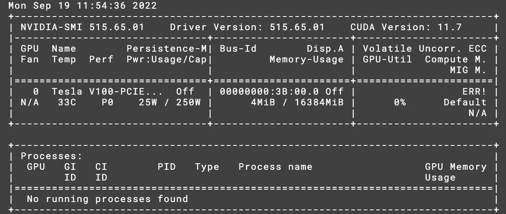

## Prerequisites
0. Get a CAS login.
1. Login to gpulab using CAS login, follow this [guide](https://gitlab.mff.cuni.cz/mff/hpc/clusters#installed-software-on-clusters). 
2. Write to admin (jakub.yaghob@mff.cuni.cz) to get access to docker.

## Docker to Charliecloud
3. Access docker with 
    ```bash
    salloc -C docker
    ```
4. Pull CUDA from docker hub
    ```bash
    sudo docker pull nvidia/cuda:11.7.1-devel-ubuntu22.04
    ```
5. Now we need to convert the docker image to charliecloud image. 
You can try to run the following code:
    ```bash
    ch-convert -i docker nvidia/cuda:11.7.1-devel-ubuntu22.04 cuda
    ```
    If you get an error (in my case it was due to my id being out of range), you need to start a docker container from the image,
    ```bash
    sudo docker run --rm -d -it --name cuda nvidia/cuda:11.7.1-devel-ubuntu22.04 bash
    ```
    then save the container as a tar file.
    ```bash
    sudo docker export cuda > cuda.tar.gz
    ```
    Then you can convert the tar file to a charliecloud image.
    ```bash
    ch-convert cuda.tar.gz cuda
    ```
    Stop the container.
    ```bash
    sudo docker stop cuda
    ```
    You can verify deletion of the container with
    ```bash
    sudo docker ps -a
    ```
6. Convert the image to folder strucutre.
    ```bash
    ch-convert cuda ./cuda
    ``` 
## CUDA
7. To upload CUDA libraries, first exit the `dw[01-05]` node
    ```bash
    username@dw[01-05]:~$ exit
    ```
    then upload the CUDA libs from node with GPU
    ```bash
    srun -p gpu-ffa --gpus=1 ch-fromhost --nvidia ./cuda
    ```
    You can verify the upload with
    ```bash
     srun -p gpu-ffa --gpus=1 ch-run cuda nvidia-smi
    ```
    You should see something like this:
    

## [cuDNN](https://docs.nvidia.com/deeplearning/cudnn/install-guide/index.html)
8. To use the cuDNN library, you need to register on the [NVIDIA Developer Program](https://developer.nvidia.com/developer-program). Then you can download the cuDNN library from [here](https://developer.nvidia.com/rdp/cudnn-download). Find the version of cuDNN that matches your CUDA version and container OS. If you are using the same container tag, as shown above download `Local Installer for Ubuntu22.04 x86_64 (Deb)` for `CUDA 11.X`. Afterwards upload the file to GPULab using `scp`
    ```bash
    scp cudnn-local-repo-ubuntu2204-8.5.0.96_1.0-1_amd64.deb username@gpulab:~/
    ```
9. Extract the cuDNN library in the Charliecloud image
    ```bash
    srun -p gpu-ffa --gpus=1 ch-run -w -u 0 -g 0 -c /home/username ./cuda -- dpkg -i cudnn-local-repo-ubuntu2204-8.5.0.96_1.0-1_amd64.deb
    ```
10. Install the cuDNN library:
    1. import key
        ```bash
        srun -p gpu-ffa --gpus=1 ch-run -w -u 0 -g 0 -c /home/username ./cuda -- cp /var/cudnn-local-repo-ubuntu2204-8.5.0.96/cudnn-local-7ED72349-keyring.gpg /usr/share/keyrings/
        ```
    3. refresh repo metadata
        ```bash
        srun -p gpu-ffa --gpus=1 ch-run -w -u 0 -g 0 -c /home/username ./cuda -- apt-get update
        ```
    4. install cuDNN
        ```bash
        srun -p gpu-ffa --gpus=1 ch-run -w -u 0 -g 0 -c /home/username ./cuda -- apt-get install libcudnn8=8.5.0.96-1+cuda11.7
        ```
        You might need to press enter to confirm the installation, even if not prompted yet. 

If needed, you can follow the official [guide](https://docs.nvidia.com/deeplearning/cudnn/install-guide/index.html) for more details, but remeber to use the prefix `srun -p gpu-ffa --gpus=1 ch-run -w -u 0 -g 0 -c /home/username ./cuda --` and run without sudo. 
The prefix explains the following: 
- `srun -p gpu-ffa --gpus=1` - run on node with GPU
- `ch-run -w -u 0 -g 0 -c /home/username ./cuda` - run as root user (`-u 0 -g 0`) in the container in `./cuda` with working directory `/home/username` and write access to the container (`-w`).
- after `--`  the command to run in the container.

## Python
11. Install python3.10
    ```bash
    srun -p gpu-ffa --gpus=1 ch-run -w -u 0 -g 0 -c /home/username ./cuda -- apt-get install python3
    ```
    Again you might need to press enter to confirm the installation, even if not prompted yet.
12. Install pip
    ```bash
    srun -p gpu-ffa --gpus=1 ch-run -w -u 0 -g 0 -c /home/username ./cuda -- apt-get install python3-pip
    ```
    Again you might need to press enter to confirm the installation, even if not prompted yet.
13. Verify the installation
    ```bash
    srun -p gpu-ffa --gpus=1 ch-run -w -c /home/username ./cuda -- python3 --version
    ```
    You should see something like this:
    ```bash
    Python 3.10.4
    ```
## Tensorflow
14. Install tensorflow
    ```bash
    srun -p gpu-ffa --gpus=1 ch-run -w -c /home/username ./cuda -- pip3 install tensorflow
    ```
15. Verify the installation
    ```bash
    srun -p gpu-ffa --gpus=1 ch-run -w -c /home/username ./cuda -- python3 -c "import tensorflow as tf; print(tf.reduce_sum(tf.random.normal([1000, 1000])))"
    ```
    You should see something like this:
    ```bash
    tf.Tensor(0.0, shape=(), dtype=float32)
    ```
16. Verify GPU support
    ```bash
    srun -p gpu-ffa --gpus=1 ch-run -w -c /home/username ./cuda -- python3 -c "import tensorflow as tf; print(tf.config.list_physical_devices('GPU'))"
    ```
    You should see something like this:
    ```bash
    [PhysicalDevice(name='/physical_device:GPU:0', device_type='GPU')]
    ```
## Notes
### Syntax highlighting and autocompletion in IDE
Include this lines in `__init__.py` file of tensorflow if you autocompletion and syntax highlighting in your IDE

    ```python
    # Explicitly import lazy-loaded modules to support autocompletion.
    # pylint: disable=g-import-not-at-top
    if _typing.TYPE_CHECKING:
        from tensorflow_estimator.python.estimator.api._v2 import estimator as estimator
        from keras.api._v2 import keras
        from keras.api._v2.keras import losses
        from keras.api._v2.keras import metrics
        from keras.api._v2.keras import optimizers
        from keras.api._v2.keras import initializers
    # pylint: enable=g-import-not-at-top
    ```
### Error when using CNN in TF
When using CNN in TF you might get the following error:
```bash
    Could not load library libcudnn_cnn_infer.so.8. Error: libcuda.so: cannot open shared object file: No such file or directory
```
To fix this, you need to add the following lines to `~/.bashrc` (use `source ~/.bashrc` to apply changes):
```bash
    export LD_LIBRARY_PATH=/usr/local/cuda/lib64:$LD_LIBRARY_PATH
    export LD_LIBRARY_PATH=/usr/local/cuda/targets/x86_64-linux/lib/:$LD_LIBRARY_PATH
```
And create symlink for `libcuda.so`:
```bash
    ln -s /usr/local/cuda/targets/x86_64-linux/lib/libcuda.so.1 /usr/local/cuda/targets/x86_64-linux/lib/libcuda.so
```